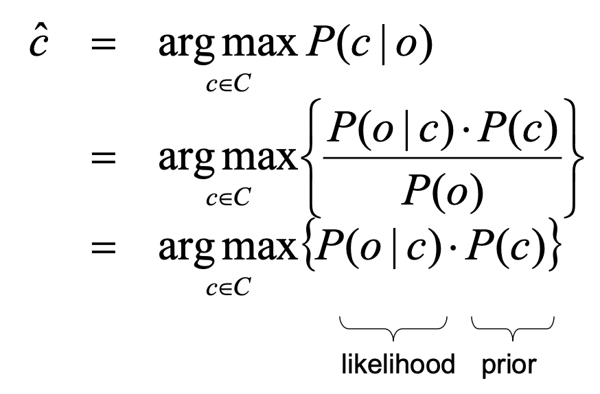
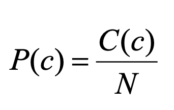
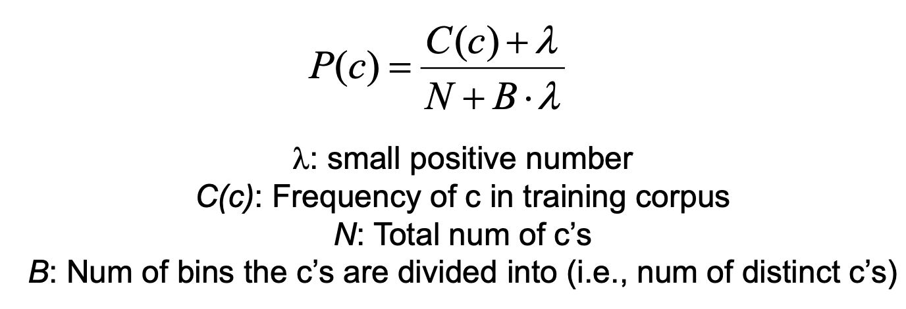
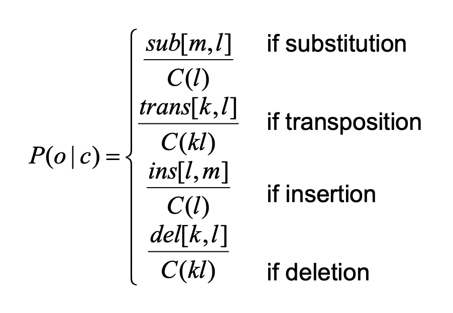

# Words, Spelling errors, Edit distance

Morpheme: the minimal meaning-bearing unit in a language
Morphology: The study of the way words are built up from morphemes

Example:
```
cats: cat-s
killer: kill-er
clueless: clue-less
```
*cat* is the stem and *s* is the affix

## Morphology

1. Inflection
    * Combine a stem and an affix to form a word in the same class as stem
2. Derivation
    * Combine a stem and an affix to form a word in a diff class
    * Harder to predict the meaning of the derived form
    * e.g. transformed a verb into a noun `computerize` to `computerization`

### Why?

* Listing al the different morphological variants in a dict is inefficient
* Morphology is scalable, applies to new words

### Porter stemming algo

Stemming: simple version of morphological analysis by <mark>stripping off affixes</mark>

Porter stemmer: A simple and efficient steming algorithm used in info retrieval. A series of
rewrite rules run in a cascade; output of each pass is fed as input into the next pass

## Tokenization

Segmenting a running text into words

Breaking off punctuation symbols as separate tokens

### Text normalization

Converting text to a more *convenient*, *standard* form

Expanding clitic contractions
* Clitic: a part of a word that *cannot stand on its own*
* e.g. we're -> we are

A single normalized form is chosen for words with multiple forms e.g. USA -> US

Case folding: Converting all words to lower case

### Penn treebank tokenization standard

* Separate out clitics
    * doesn't -> does n't
    * John's -> John 's

* Keep hyphenated words together
* Separate out all punctuation symbols

## Spelling errors

### Three increasingly broader problems
1. Non-word error detetion
    * detecting *graffe* (misspelled from giraffe)
2. Isolated-word error correction
    * correcting *graffe* to *giraffe*
3. Context-sensitive error detection and correction
    * Use of context to detect and correct spelling errors
    * real-world errors

### Spelling error patterns
Most misspelled words in human typewritten text are <mark>single-error misspellings</mark>

Examples:
* Damerau
* Peterson

**Types of misspellings:**
* Insertion: mistyping the as ther
* Deletion: mistyping the as th
* Substitution: mistyping the as thw
* Transposition: mistyping the as hte

**Classes of misspellings**
1. Typographic
    * misspell spell as speel
2. Cognitive errors
    * misspelling separate as seperate


## Spelling error correction

Proposing candidates of correctly spelled words needs large dictionary of words and
assume single-error misspellings

Example:
1. given a mis-spelled word acress
2. determine whether the correct word is actress, cress or acres
3. use Bayesian classification

### Bayesian classification
Problem: Given an observation o and a set of classes C, infer the class c that o belongs to

Choose the class c which is the most probable given the observation o



* need a corpus of annotated text where misspelled words are identified and labeled
* supervised ML
* gather probability estimates from the annotated corpus

#### Estimating the prior


C(c1) is the number of words for that class c1
N is the total number of words

#### Smoothing


`N = C(c1) + C(c2) + C(c3) + ...`

#### Estimating the likelihood P(o|c)
- Use letter frequencies in annotated training corpus to approximate P(o|c). We do this becuase
we have more data compared to using whole words
- `o` is the ovserved misspelled word
- sub[m, l]: number of times the correct later l was typed as m
- trans[k, l]: number of times the correct letter sequence kl was typed as lk
- ins[l, m]: number of times the extraneous letter m was inserted after l
- del[k, l]: number of times the letter l was deleted from the correct letter sequence kl



### Minimum edit distance
- Multiple error misspellings
- Minimum edit distance between two strings: insertion, deletion, substitution

> See some tips on https://www.youtube.com/watch?v=Thv3TfsZVpw
